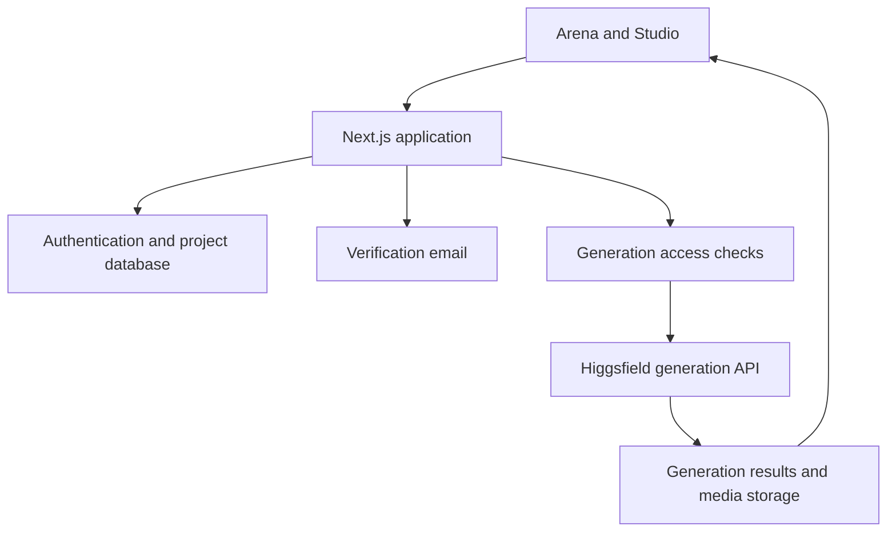

# Architecture overview

RenderHalo uses a Next.js and React interface, server-side application actions, Better Auth email/password authentication, PostgreSQL on Neon, and Vercel hosting and media storage. Resend provides transactional verification email. The Higgsfield API supplies generation models.

## Generation access

The server selects either a user's encrypted provider credential or the sponsored trial credential. Browser requests cannot choose the sponsored credential or raise sponsored generation limits. Trial access is bounded by approved models, image count, video duration and resolution, plus operator-wide spending limits.

Database transactions reserve trial usage before submission. Retained identity claims help prevent repeated registration from resetting access. Account, normalized email, device, and network signals are abuse controls, not proof of a unique person; shared networks can affect eligibility. No system can guarantee one physical person has exactly one online identity.

Provider request timeouts bound waiting. Ambiguous provider failures are not automatically refunded because a timed-out request may already be billable.

## Scope

This diagram explains responsibilities at a high level. It omits production secrets, deployment configuration, database contents, and implementation details. The showcase itself runs no application services and triggers no production deployment.
