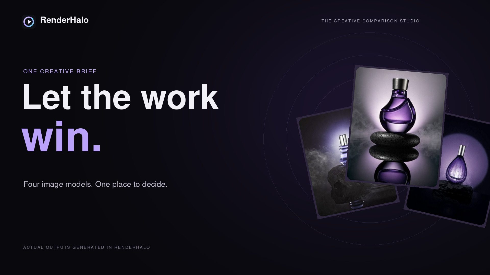
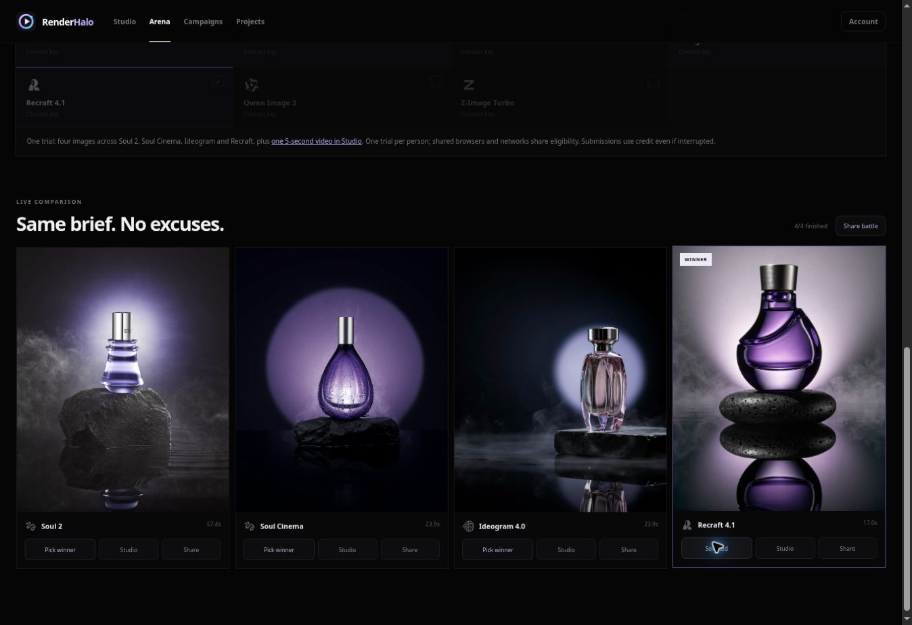

# RenderHalo

**One brief. Four models. Let the work win.**

RenderHalo is a workspace for comparing AI image outputs, choosing a favorite, and generating video.

[Try RenderHalo](https://www.renderhalo.xyz/) · [Watch the 20-second demo on X](https://x.com/saboreq90646/status/2102287581073363041) · [Public roadmap](ROADMAP.md)

## See it in action

[Play the 20-second commercial on X](https://x.com/saboreq90646/status/2102287581073363041). The edit uses actual RenderHalo trial outputs, captured product UI, animated titles, and original sound design.

The showcase used Soul 2, Soul Cinema, Ideogram 4, and Recraft 4.1 for a luxury fragrance brief. A separate Kling 3 Turbo generation supplied the five-second motion shot. The winner reflects a creative preference for this brief, not a general model benchmark. The motion shot was generated separately; it is not an image-to-video conversion of the selected image.

## How it works

1. Create an account and verify your email.
2. Use the sponsored trial to compare four selected image models and create one five-second video, subject to trial eligibility and available sponsorship.
3. Continue with your own Higgsfield API key after the trial.

Arena lets you compare results before revealing model identities. Studio provides image and video generation in the same workspace. Projects keep creative work organized.

## About this repository

This is the public product showcase, documentation, and feedback hub. The production application is maintained separately in a private repository. No application source, account data, environment configuration, or API credentials are included here. This repository is not a self-hostable distribution.

- [Architecture overview](ARCHITECTURE.md)
- [Roadmap](ROADMAP.md)
- [Feedback and contributions](CONTRIBUTING.md)
- [Security reporting](SECURITY.md)

## Credits and reuse

RenderHalo is an independent product built around the Higgsfield API. The application began from [wide-trace/open-higgsfield](https://github.com/wide-trace/open-higgsfield). This showcase does not redistribute that application's source. Model and provider names belong to their respective owners; no endorsement is implied.

The repository is published for viewing and discussion. No additional open-source or media reuse license is granted. Contact [contact@saboreq.xyz](mailto:contact@saboreq.xyz) for reuse requests. Rights in generated media may also depend on provider terms and applicable law.
